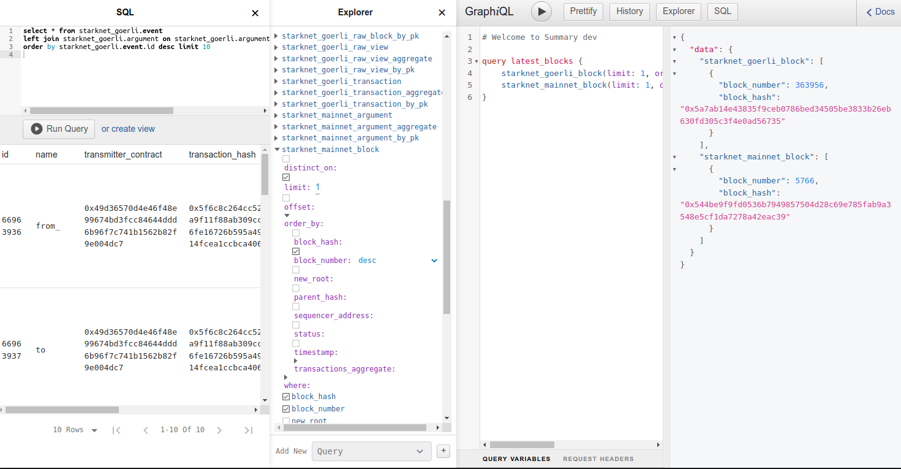

# Summary Blockchain Indexer</br> and Web3 Tools

Summary is a suite of tools that let Web3 developers:

- analyze blockchain data
- automate workflows with smart contract events
- create charts and dashboards
- store data for decentralized applications

**Summary Blockchain Indexer** gathers blockchain data, decodes,
persists and makes it available for analysis by GraphQL, SQL and API
queries.

We started with [StarkNet](https://starknet.io/what-is-starknet/) L2
network and have its data indexed from both the main and test chains.
The data is synced up to the latest block available from the network's
API.

You can query the data via GraphQL in our
[web console](../../starknet-all.html).

## Quick start 

[Developer console](../../starknet-all.html) is open to query blockchain data for
events, transactions and their inputs, as well as to
[filter](queries.md#filter), aggregate and
[sum up](queries.md#aggregation) values.



Try this sample **GraphQL** in the middle pane editor. It queries for
the latest block numbers and their hashes in StarkNet *mainnet* and test
chains *goerli* and *testnet2*.

```graphql
query latest_blocks {
    starknet_mainnet_block(limit: 1, order_by: {block_number: desc}) {block_number block_hash}
}
```

Now open the **SQL** console and try this select to query for the last
10 events emitted by StarkNet smart contracts in the test chain
goerli.

```sql
select * from starknet_goerli.event 
left join starknet_goerli.argument on starknet_goerli.argument.event_id = starknet_goerli.event.id 
order by starknet_goerli.event.id desc limit 10
```

