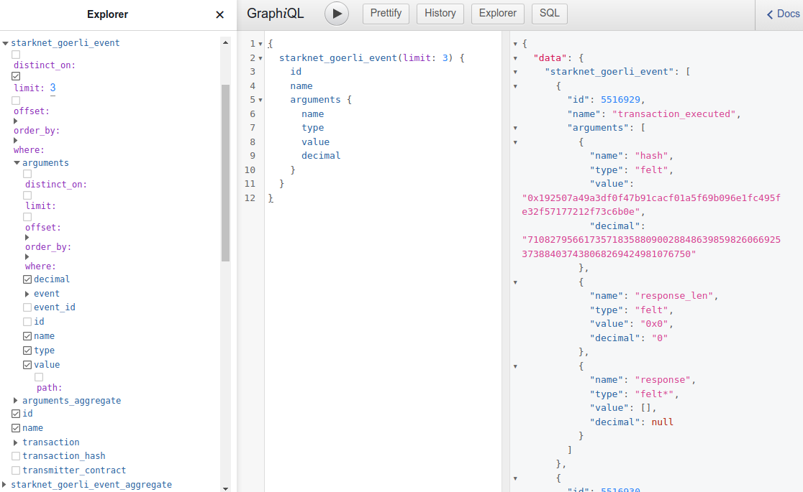
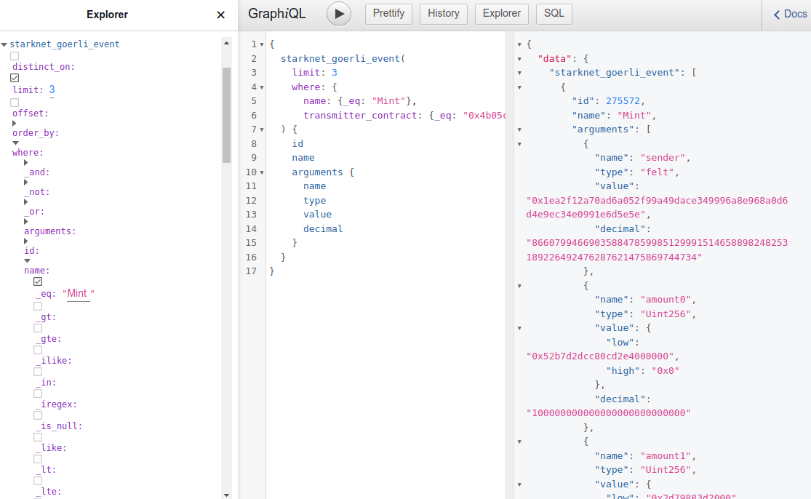

# Query blockchain data with GraphQL

We store blockchain data decoded and normalized in tables in a
relational database. Then make this data available for querying by
GraphQL and SQL. 

**GraphQL** lets you combine queries and retrieve records related and
not, all by one query, saving you round trips getting them piece by
piece like in REST APIs. It is also easier to construct than SQL and
lends itself well to be used in API calls as it returns json. A
developer can craft a GraphQL query in the [web console](../../console)
and once it's perfected can send the same query to our http
[API](api.md) endpoint.

Queries with [SQL](sql.md) can be more sophisticated and are used for
grouping and joining records which would not be possible with GraphQL.
These queries can then be wrapped into GraphQL by making them into
persistent queries as [views](sql.md#views).

Let's look at the basics of GraphQL queries for blockchain data. 

## Explorer

While you can write queries by hand you may find the GraphQL schema
**Explorer** useful in the beginning. Open the pane on the left to put
together a GraphQL query by selecting entities to return with their
fields, and by adding filter, limit and sort parameters.

Navigate to find entities you're interested in, like *events* in 
StarkNet test chain *goerli*. Open node `starknet_goerli_event` in the
Explorer's tree and select the fields you want to retrieve like `name`.
Smart contracts emit events with some payload that we parse into
`arguments`, so select these in the tree together with their fields
`value` and others.



## Filter

There are millions of events in the database and you don't want to
retrieve all of them, so let's narrow down the search by adding *where*
clause filters and *limit* the number of records returned.

Open the `where` node in the tree under `starknet_goerli_event` to add
filter and `limit` conditions:

- event `name` field is equal `_eq` to `Mint`
- smart contract address that emitted the event `_eq` to `0x4b0...`
- `limit` results to 3.



One of the features of GraphQL is the ability to combine many entities
in one query. To illustrate it here let's add a query for all `DEPLOY`
transactions in block 100000, together with their inputs. Note here that
you can filter entities at all levels: the block by its `block_number`
and transactions within the block by their `type`.

If you paste this query into the middle editor pane it will open the
corresponding nodes in the Explorer: the panes work nicely together.

```graphql
{
  starknet_goerli_event(where: {
    name: {_eq: "Mint"}, 
    transmitter_contract: {_eq: "0x4b05cce270364e2e4bf65bde3e9429b50c97ea3443b133442f838045f41e733"}
    }, 
    limit: 3) {
    name
    arguments {
      name
      type
      value
      decimal
    }
    transaction_hash
  }
  starknet_goerli_block(where: {
    block_number: {_eq: 100000}}) {
    transactions(where: {type: {_eq: "DEPLOY"}}) {
      function
      entry_point_selector
      inputs {
        name
        type
        value
      }
    }
  }
}
```

You can get query results directly from our http endpoint. Send the
query you tried in the web console as an http POST parameter with
`curl`:
```bash
curl https://hasura.prod.summary.dev/v1/graphql --data-raw '{"query":"{starknet_goerli_event(where: {name: {_eq: \"Mint\"}, transmitter_contract: {_eq: \"0x4b05cce270364e2e4bf65bde3e9429b50c97ea3443b133442f838045f41e733\"}}, limit: 3) { name arguments { name type value decimal } transaction_hash} starknet_goerli_block(where: {block_number: {_eq: 100000}}) {transactions(where: {type: {_eq: \"DEPLOY\"}}) {function entry_point_selector inputs {name type value}}}}"}'
```

More on this in the section on our [API](api.md).

## Input and event data decoded with ABI

Blockchain APIs return transaction inputs and event payload in bulk
arrays of binary data which are hard to interpret. We decode these for
you with smart contract ABIs. For [proxy contracts](#proxy-contracts) we
attempt to find the implementation contract's ABI to parse the data
correctly.

Take a look at the transactions and events of block 100000 parsed and
decoded. Try this query (which omits most fields for brevity).

```graphql
{
  starknet_goerli_block(where: {block_number: {_eq: 100000}}) {
    transactions {
      function
      entry_point_selector
      inputs {
        name
        type
        value
      }
      events {
        name
        transmitter_contract
        arguments {
          name
          type
          value
          decimal
        }
      }
    }
  }
}
```

Transaction function and its inputs are decoded using the contract's
ABI. See smart contract function name decoded as `execute` together with
its inputs: `to` as type `felt`, `calldata` as a three element `felt`
array.

```json
{
"function": "execute",
"entry_point_selector": "0x240060cdb34fcc260f41eac7474ee1d7c80b7e3607daff9ac67c7ea2ebb1c44",
"inputs": [
  {
    "name": "to",
    "type": "felt",
    "value": "0x4bc8ac16658025bff4a3bd0760e84fcf075417a4c55c6fae716efdd8f1ed26c"
  },
  {
    "name": "selector",
    "type": "felt",
    "value": "0x219209e083275171774dab1df80982e9df2096516f06319c5c6d71ae0a8480c"
  },
  {
    "name": "calldata",
    "type": "felt[3]",
    "value": [
      "0x263acca23357479031157e30053fe10598077f24f427ac1b1de85487f5cd124",
      "0x204fce5e3e25026110000000",
      "0x0"
    ]
  },
  {
    "name": "nonce",
    "type": "felt",
    "value": "0x64"
  }
]
}
``` 

Events are also decoded: see `Transfer` event and its argument `tokenId`
as struct `Uint256` with `low` and `high` hex, also converted into a
decimal number. Converting from felt and Uint256 into decimal is useful
for summing up and comparing values.

```json
{
"events": [
  {
    "name": "Transfer",
    "transmitter_contract": "0x4e34321e0bce0e4ff8ff0bcb3a9a030d423bca29a9d99cbcdd60edb9a2bf03a",
    "arguments": [
      {
        "name": "from_",
        "type": "felt",
        "value": "0x0",
        "decimal": "0"
      },
      {
        "name": "to",
        "type": "felt",
        "value": "0x1778c6596d715a8613d0abcbe4fc08c052d208dce3b43eeb6b4dc24ddd62ed9",
        "decimal": "663536632620382607614490239145922341009321511960837718021901264100395462361"
      },
      {
        "name": "tokenId",
        "type": "Uint256",
        "value": {
          "low": "0x3d5b",
          "high": "0x0"
        },
        "decimal": "15707"
      }
    ]
  }
]
}
```

Let's get the raw block for comparison. Paste this into the GraphQL
query window and you'll see `raw` block 100000 as we received it from
the blockchain node API, with its transaction `calldata` and event
payload `data` undecoded.

```graphql
{
  starknet_goerli_raw_block_by_pk(block_number: 100000) {
    raw
  }
}
```

The raw block has transaction inputs as `calldata` in a bulk array, like
in this excerpt.

```json
{
"type": "INVOKE_FUNCTION",
"max_fee": "0x0",
"calldata": [
  "0x4bc8ac16658025bff4a3bd0760e84fcf075417a4c55c6fae716efdd8f1ed26c",
  "0x219209e083275171774dab1df80982e9df2096516f06319c5c6d71ae0a8480c",
  "0x3",
  "0x263acca23357479031157e30053fe10598077f24f427ac1b1de85487f5cd124",
  "0x204fce5e3e25026110000000",
  "0x0",
  "0x64"
]
}
```

Event payload `data` is in bulk as well. 

```json
{
"events": [
  {
    "data": [
      "0x0",
      "0x1778c6596d715a8613d0abcbe4fc08c052d208dce3b43eeb6b4dc24ddd62ed9",
      "0x3d5b",
      "0x0"
    ],
    "keys": [
      "0x99cd8bde557814842a3121e8ddfd433a539b8c9f14bf31ebf108d12e6196e9"
    ],
    "from_address": "0x4e34321e0bce0e4ff8ff0bcb3a9a030d423bca29a9d99cbcdd60edb9a2bf03a"
  }
]
}
```

## Query for your contract's events

You are probably interested not in whole blocks but in events emitted by
your own contract. Let's see how we can search with this query for
`Mint` events of contract `0x4b0...`, limited to one result for brevity.

```graphql
{
  starknet_goerli_event(where: 
    {
        name: {_eq: "Mint"}, 
        transmitter_contract: {_eq: "0x4b05cce270364e2e4bf65bde3e9429b50c97ea3443b133442f838045f41e733"}
    }, 
    limit: 1) {
    name
    arguments {
      name
      type
      value
      decimal
    }
    transaction_hash
  }
}
```

The query returns your event with its payload *arguments* decoded.

```json
{
  "data": {
    "event": [
      {
        "name": "Mint",
        "arguments": [
          {
            "name": "sender",
            "type": "felt",
            "value": "0x1ea2f12a70ad6a052f99a49dace349996a8e968a0d6d4e9ec34e0991e6d5e5e",
            "decimal": "866079946690358847859985129991514658898248253189226492476287621475869744734"
          },
          {
            "name": "amount0",
            "type": "Uint256",
            "value": {
              "low": "0x52b7d2dcc80cd2e4000000",
              "high": "0x0"
            },
            "decimal": "100000000000000000000000000"
          },
          {
            "name": "amount1",
            "type": "Uint256",
            "value": {
              "low": "0x2d79883d2000",
              "high": "0x0"
            },
            "decimal": "50000000000000"
          }
        ],
        "transaction_hash": "0x521e56da1f33412f2f5e81dc585683c47b19783995aa3ebdcd84f5739cea489"
      }
    ]
  }
}
```

You can send the same query to the http API endpoint; here we omitted
the `limit` to get all `Mint` events. Such queries can be automated and 
feed your web and backend applications.

```bash
curl https://hasura.prod.summary.dev/v1/graphql --data-raw '{"query":"query { starknet_goerli_event(where: {name: {_eq: \"Mint\"}, transmitter_contract: {_eq: \"0x4b05cce270364e2e4bf65bde3e9429b50c97ea3443b133442f838045f41e733\"}}) { name arguments { name type value decimal } transaction_hash }}"}'
```

Naturally, you can add as many conditions to `where` clause as
needed to select the events you're interested in.

This query returns 10 `Mint` events as `starknet_goerli_event` entities
which have `arguments` with `amount1` values less than 10. See the
`where` clause selecting events with payload `arguments` with name `_eq`
to `amount1` and its value in decimal less than `_lt` 10.

```graphql
query event_mint_argument_amount1_lte_10 {
  starknet_goerli_event(where: {
      arguments: {
        name: {_eq: "amount1"}, 
        decimal: {_lt: "10"}
      }, 
      name: {_eq: "Mint"}, 
      transmitter_contract: {_eq: "0x4b05cce270364e2e4bf65bde3e9429b50c97ea3443b133442f838045f41e733"}
    },
    limit: 10) {
    name
    arguments {
      name
      type
      value
      decimal
    }
    transaction_hash
  }
}
```

The following query accomplishes the same, but from the other end: it
requests all arguments as `starknet_goerli_argument` entities,
satisfying conditions `amount1` and `< 10`, and whose owning event is
`Mint` of contract `0x4b0...`. The query returns results as arguments
together with their event, transaction and its block number.

```graphql
query argument_amount1_lte_10_event_mint {
  starknet_goerli_argument(where: {
      decimal: {_lt: "10"}, 
      name: {_eq: "amount1"}, 
      event: {name: {_eq: "Mint"}, transmitter_contract: {_eq: "0x4b05cce270364e2e4bf65bde3e9429b50c97ea3443b133442f838045f41e733"}}
    },
    limit: 10) {
    decimal
    name
    type
    value
    event {
      transaction_hash
      transaction {
        block_number
      }
    }
  }
}
```

Another example query requests 10 `Transfer` events with a given
destination address `0x455...` specified by the `to` event argument.
Note these events come from various contracts as seen in different
`transmitter_contract` fields, and you can narrow down further if
needed.

```graphql
query event_transfer_to {
  starknet_goerli_event(where: {name: {_eq: "Transfer"}, 
    arguments: {name: {_eq: "to"}, value: {_eq: "0x455eb02b7080a4ad5d2161cb94928acec81a4c9037b40bf106c4c797533c3e5"}}}
    limit: 10) {
    name
    arguments {
      name
      type
      value
      decimal
    }
    transaction_hash
    transmitter_contract
  }
}
```

## Query for values in JSON payloads

Some event and transaction payload fields are atomic of type `felt` and
are easily accessible by queries, but some are members of *structs* and
are stored as json values.

If the data you're interested in lies in a field inside json, you can
get to it by specifying a path to this field in your query.

This query searches for smart contract function input `index_and_x` of
contract `0x579...` which is defined as a struct.

```graphql
{
  starknet_goerli_input(where: {name: {_eq: "index_and_x"}, 
    transaction: {contract_address: {_eq: "0x579f32b8090d8d789d4b907a8935a75f6de583c9d60893586e24a83d173b6d5"}}}, 
    limit: 1) {
    value
  }
}
```

The result is the value of `index_and_x` as json with fields `index` and
`values`.

```json
{
  "data": {
    "input": [
      {
        "value": {
          "index": "0x39103d23f38a0c91d4eebbc347a5170d00f4022cbb10bfa1def9ad49df782d6",
          "values": [
            "0x586dbbbd0ba18ce0974f88a19489cca5fcd5ce29e723ad9b7d70e2ad9998a81",
            "0x6fefcb8a0e36b801fe98d66dc1513cce456970913b77b8058fea640a69daaa9"
          ]
        }
      }
    ]
  }
}
```

The following query digs into json by specifying path `values[1]` to the
second half of the tuple named `values`. Note the path is not part of
the where clause but is applied to the returned field directly.

```graphql
{
  starknet_goerli_input(where: {name: {_eq: "index_and_x"}, 
    transaction: {contract_address: {_eq: "0x579f32b8090d8d789d4b907a8935a75f6de583c9d60893586e24a83d173b6d5"}}}, limit: 1) {
    value(path: "values[1]")
  }
}
```

And returns bare `y` values of `index_and_x`:

```json
{
  "data": {
    "input": [
      {
        "value": "0x6fefcb8a0e36b801fe98d66dc1513cce456970913b77b8058fea640a69daaa9"
      }
    ]
  }
}
```

Let's see what the ABI of our contract `0x579...` looks like.

```graphql
{
  starknet_goerli_raw_abi_by_pk(contract_address: "0x579f32b8090d8d789d4b907a8935a75f6de583c9d60893586e24a83d173b6d5") {
    raw(path: "[0]")
  }
}
```

The type of `index_and_x` input is struct `IndexAndValues`. See its
definition in the ABI that shows how to get the second half of the tuple
`values(x : felt, y : felt)` by `path: "values[1]"`.

```json
{
  "data": {
    "raw_abi_by_pk": {
      "raw": {
        "name": "IndexAndValues",
        "size": 3,
        "type": "struct",
        "members": [
          {
            "name": "index",
            "type": "felt",
            "offset": 0
          },
          {
            "name": "values",
            "type": "(x : felt, y : felt)",
            "offset": 1
          }
        ]
      }
    }
  }
}
```

## Proxy contracts

Proxy contracts delegate transaction function calls to implementation
contracts. Transaction input and event data are encoded per
implementation contract's ABI. Implementation contracts change and with
them changes the proxy contract's ABI. 

While interpreting proxy contract calls may be challenging, the data can
still be decoded, by finding the implementation contract and its ABI.
This is done by calling `get_implementation` or a similar method of the
proxy contract, or by looking at the latest `Upgraded` or similarly
named event indicating the implementation changed.

This query requests three transactions sent to a proxy contract
`0x474...`. You see the first `DEPLOY` transaction setting the
implementation contract address to `0x90a...`. 

Let's add to the query a call to `raw_abi` to get ABIs for both proxy 
and implementation contracts, for demonstration.

```graphql
{
  starknet_goerli_transaction(limit: 3, where: {contract_address: {_eq: "0x47495c732aa419dfecb43a2a78b4df926fddb251c7de0e88eab90d8a0399cd8"}}) {
    inputs {
      type
      value
      name
    }
    function
  }
  starknet_goerli_raw_abi(where: {contract_address: {_in: ["0x47495c732aa419dfecb43a2a78b4df926fddb251c7de0e88eab90d8a0399cd8", "0x90aa7a9203bff78bfb24f0753c180a33d4bad95b1f4f510b36b00993815704"]}}) {
    contract_address
    raw
  }
}
```

See the contract function input `call_array` of type `CallArray` is
defined in the implementation, not the proxy contract's ABI.

```json
{
"contract_address": "0x90aa7a9203bff78bfb24f0753c180a33d4bad95b1f4f510b36b00993815704",
    "raw": [
      {
        "name": "CallArray",
        "size": 4,
        "type": "struct",
        "members": [
          {
            "name": "to",
            "type": "felt",
            "offset": 0
          },
          {
            "name": "selector",
            "type": "felt",
            "offset": 1
          },
          {
            "name": "data_offset",
            "type": "felt",
            "offset": 2
          },
          {
            "name": "data_len",
            "type": "felt",
            "offset": 3
          }
        ]
      }
    ]
}
```

Yet `call_array` is still decoded properly as `__execute__` function's
input. See this excerpt from the query result:

```json
{
"inputs": [
    {
    "type": "CallArray[1]",
    "value": [
      {
        "to": "0x4c5327da1f289477951750208c9f97ca0f53afcd256d4363060268750b07f92",
        "data_len": "0x3",
        "selector": "0x219209e083275171774dab1df80982e9df2096516f06319c5c6d71ae0a8480c",
        "data_offset": "0x0"
      }
    ],
    "name": "call_array"
    },
    {
    "type": "felt[3]",
    "value": [
      "0x30295374333e5b9fc34de3ef3822867eaa99af4c856ecf624d34574f8d7d8ea",
      "0xffffffffffffffffffffffffffffffff",
      "0xffffffffffffffffffffffffffffffff"
    ],
    "name": "calldata"
    },
    {
    "type": "felt",
    "value": "0x0",
    "name": "nonce"
    }
    ],
    "function": "__execute__"
}
```

## Aggregation

By now you know how to query for all your inputs and events, but how do
you interpret them: sum them up, compare or calculate? 

Let's say you want to derive a number from some of your events, for example, to
calculate Total Value Locked, which is a sum of arguments `amount0` of
all `Mint` events.

One approach is to query for all of the values of `amount0`; here we
limit results to 10 for brevity.

```graphql
{
  starknet_goerli_argument(where: {
      name: {_eq: "amount0"}, 
      event: {name: {_eq: "Mint"}, transmitter_contract: {_eq: "0x4b05cce270364e2e4bf65bde3e9429b50c97ea3443b133442f838045f41e733"}}
    }, 
    limit: 10) {
    type
    value
    name
    decimal
  }
}
```

See the values as `Uint256` struct and also conveniently converted into
decimals so you can sum them up.

```json
{
    "type": "Uint256",
    "value": {
      "low": "0x52b7d2dcc80cd2e4000000",
      "high": "0x0"
    },
    "name": "amount0",
    "decimal": "100000000000000000000000000"
}
```

You can consume this query's results by your own software and sum up the
values of `amount0`. This is the approach of some other indexers.

But since your data is already in a relational database's table, you can
run an **aggregation** query over the values, which sums them up and
returns the final result in the same query, all with no extra coding 
effort.

That's why the values were converted into decimals when they were
persisted: GraphQL query `argument_aggregate` calls a SQL query with an
aggregation function `sum` over a numeric column. Database type `numeric
78` used for the `decimal` column is large enough to support Uint256 and
felt and arithmetic operations over them.

This query aggregates decimal values of `amount0` arguments of all 
`Mint` events.

```graphql
{
  starknet_goerli_argument_aggregate(where: {
      name: {_eq: "amount0"}, 
      event: {name: {_eq: "Mint"}, transmitter_contract: {_eq: "0x4b05cce270364e2e4bf65bde3e9429b50c97ea3443b133442f838045f41e733"}}
    }) {
    aggregate {
      sum {
        decimal
      }
      avg {
        decimal
      }
      min {
        decimal
      }
      max {
        decimal
      }
    }
  }
}
```

Returns the total sum (TVL) as well as results of other aggregation 
functions: min, max, avg.

```json
{
  "data": {
    "argument_aggregate": {
      "aggregate": {
        "sum": {
          "decimal": "7312519852578770281612328156"
        },
        "avg": {
          "decimal": "148767543894266393001838"
        },
        "min": {
          "decimal": "25047631971864"
        },
        "max": {
          "decimal": "5000000000000000000000000000"
        }
      }
    }
  }
}
```