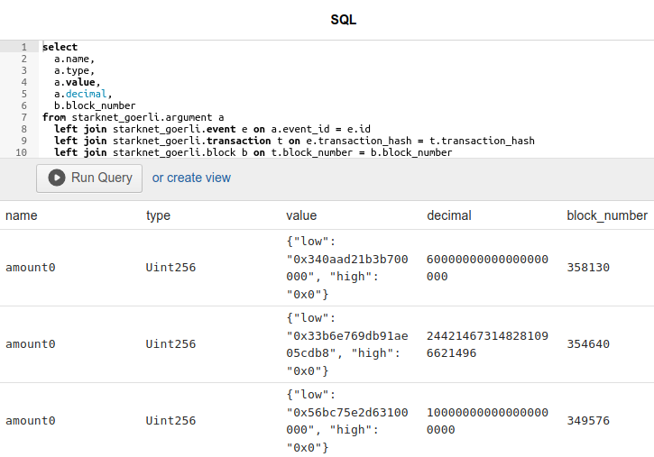
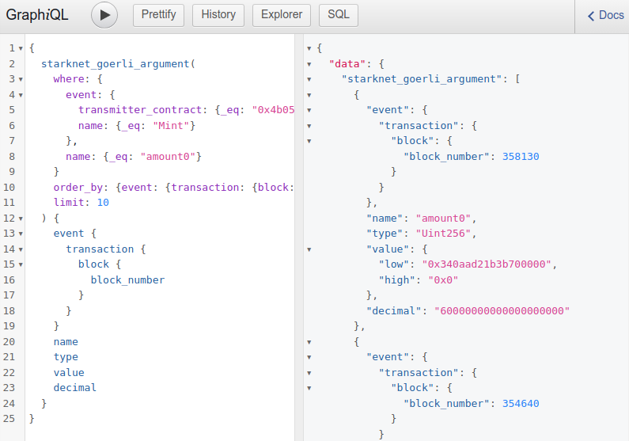
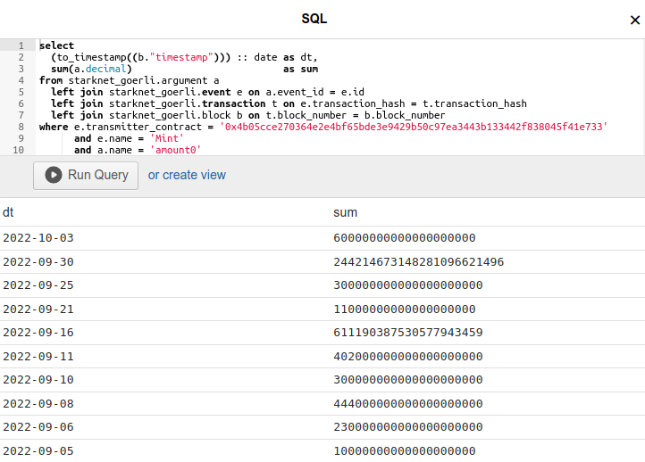
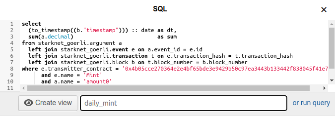
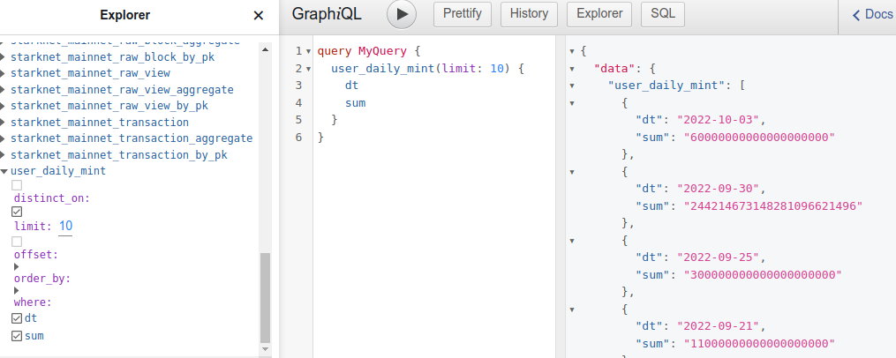
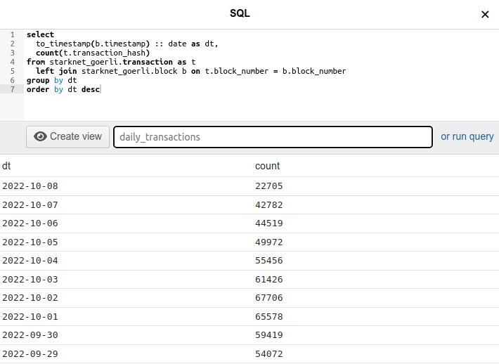
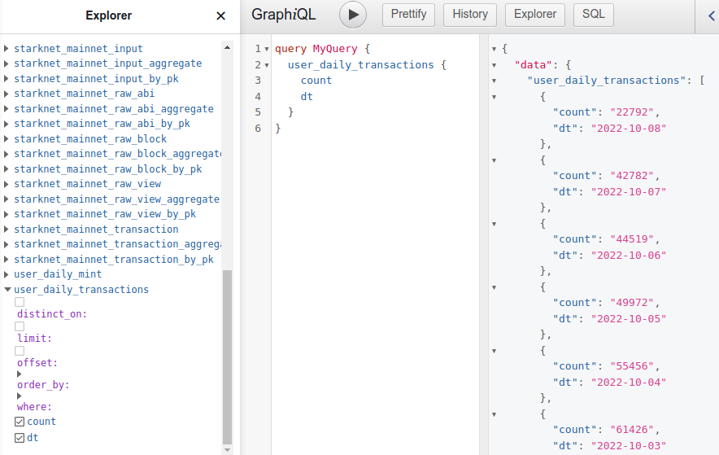

# Query blockchain data with SQL

Blockchain data we collect and index is stored in a relational database
so it is natural to provide access to it with its native query language
**SQL**.

## Compare to GraphQL

We find GraphQL well suited for data exploration, API access and some
analysis. GraphQL works well for queries fetching blockchain data with
any level of detail, and it lets you join and
[filter](queries.md#filter) entities. You can use it to sum up values
for analysis with [aggregation](queries.md#aggregation) queries. For the
majority of use cases in can replace SQL.

Let's go through some queries and compare their implementation in both
GraphQL and SQL. We'll see they're equivalent until more complex cases
arise which GraphQL cannot handle and we'll have to switch to SQL.

### Selects

The following two queries fetch payload arguments named `amount0` of
event `Mint` of contract `0x4b05...`.

```graphql
{
  starknet_goerli_argument(
    where: {
      event: {
        transmitter_contract: {_eq: "0x4b05cce270364e2e4bf65bde3e9429b50c97ea3443b133442f838045f41e733"}, 
        name: {_eq: "Mint"}
      }, 
      name: {_eq: "amount0"}
    }
    order_by: {event: {transaction: {block: {block_number: desc}}}}
    limit: 10
  ) {
    event {
      transaction {
        block {
          block_number
        }
      }
    }
    name
    type
    value
    decimal
  }
}
```

The SQL query is as concise as GraphQL except perhaps for the verbose
`join`s.

```sql
select
  a.name,
  a.type,
  a.value,
  a.decimal,
  b.block_number
from starknet_goerli.argument a
  left join starknet_goerli.event e on a.event_id = e.id
  left join starknet_goerli.transaction t on e.transaction_hash = t.transaction_hash
  left join starknet_goerli.block b on t.block_number = b.block_number
where e.transmitter_contract = '0x4b05cce270364e2e4bf65bde3e9429b50c97ea3443b133442f838045f41e733'
      and e.name = 'Mint'
      and a.name = 'amount0'
order by b.block_number desc
limit 10;
```

Open the SQL editor in the [web console](../../console) to try the
query.



You may find GraphQL more useful here as it returns easy to consume json
output instead of rows returned by SQL.



### Aggregations

Let's try aggregation queries to sum up values of our argument
`amount0`.

```sql
select sum(a.decimal) as sum
from starknet_goerli.argument a
  left join starknet_goerli.event e on a.event_id = e.id
where e.transmitter_contract = '0x4b05cce270364e2e4bf65bde3e9429b50c97ea3443b133442f838045f41e733'
      and e.name = 'Mint'
      and a.name = 'amount0';
```

```graphql
{
  starknet_goerli_argument_aggregate(where: {
      name: {_eq: "amount0"}, 
      event: {name: {_eq: "Mint"}, transmitter_contract: {_eq: "0x4b05cce270364e2e4bf65bde3e9429b50c97ea3443b133442f838045f41e733"}}
    }) {
    aggregate {
      sum {
        decimal
      }
    }
  }
}
```

Both queries arrive at the same number
`7468354995607923658930301617` which may tell you something. 

So far both GraphQL and SQL get the job done.

### Complex aggregations

Now for a more meaningful analysis let's try to calculate *daily mint
volume* of a given smart contract. We would need to sum up all `amount0`
values of `Mint` events emitted per day. We determine date by
`timestamp` fields of `block`s that contains transactions with our
events, and would need to round them up to `date`s.

Alas, this is not possible with the GraphQL aggregation queries we have
available. But SQL does it well with its functions and the aggregation
keyword `group by`.

```sql
select
  (to_timestamp((b."timestamp"))) :: date as dt,
  sum(a.decimal)                          as sum
from starknet_goerli.argument a
  left join starknet_goerli.event e on a.event_id = e.id
  left join starknet_goerli.transaction t on e.transaction_hash = t.transaction_hash
  left join starknet_goerli.block b on t.block_number = b.block_number
where e.transmitter_contract = '0x4b05cce270364e2e4bf65bde3e9429b50c97ea3443b133442f838045f41e733'
      and e.name = 'Mint'
      and a.name = 'amount0'
group by dt
order by dt desc
limit 10;
```

Returns a table you can interpret and perhaps make a chart out of.



## Views

You can use the full power and flexibility of SQL in the web console and
observe the results in the output table. But can you consume these
results as easily as you do the ones from GraphQL? Which returns json
and can be called via http. Yes you can, with the help of *views* which
can turn your SQL select statements into GraphQL queries.

Enter SQL `select` statement of your query into the web console editor.
But instead of `Run Query` switch to `create view`, give it a name then
`Create view`. We'll persist your query as a database view and make it
available as a GraphQL query node. Note its name will be prefixed with
`user_` to distinguish it from the existing entities.



You can find this new query `user_daily_mint` in the Explorer and run it
just like any other GraphQL query.



The query can also be called via API and its results can be
easily consumed as json.

```bash
curl https://hasura.dev.summary.dev/v1/graphql --data-raw '{"query":"{user_daily_mint {dt sum}}"}'
```

## Examples

Let's look at a couple of examples that show how SQL can be used to
analyse blockchain data, then can be turned into persistent GraphQL
queries to be consumed via our API.

### Daily transaction count

This SQL select counts total transactions per day.
Note the familiar rounding of `block.timestamp` to `date` which we use to
`group by`.

```sql
select
  to_timestamp(b.timestamp) :: date as dt,
  count(t.transaction_hash)
from starknet_goerli.transaction as t
  left join starknet_goerli.block b on t.block_number = b.block_number
group by dt
order by dt desc
```

With this select we create `daily_transactions` view in the web console's
SQL editor...
 

 
... to find `user_daily_transactions` node in GraphQL Explorer.



And call the query with http API. Results of such statistical queries can be used to construct charts.

```bash
curl https://hasura.dev.summary.dev/v1/graphql --data-raw '{"query":"{user_daily_transactions {dt count}}"}'
```

### Top functions

This SQL select counts the number of smart contract function invocations
and sorts them by the this count to show the ones called the most.

```sql
select
  t.function,
  count(t.function) ct
from starknet_goerli.transaction t
group by t.function
order by ct desc;
```

GraphQL query created from this select `user_top_functions`... 

```graphql
{
  user_top_functions(limit: 5) {
    function
    ct
  }
}
```

... returns 5 most popular functions.

```json
{
  "data": {
    "user_top_functions": [
      {
        "function": "__execute__",
        "ct": "5558963"
      },
      {
        "function": "execute",
        "ct": "1414980"
      },
      {
        "function": "constructor",
        "ct": "978904"
      },
      {
        "function": "anonymous",
        "ct": "763224"
      },
      {
        "function": "initialize",
        "ct": "322249"
      }
    ]
  }
}
```

Try it via http API.

```bash
 curl https://hasura.dev.summary.dev/v1/graphql --data-raw '{"query":"{user_top_functions {function ct}}"}'
```

The above examples show that you can use SQL queries which can be rather
complex, to aggregate over any data you may be interested in.

In most cases no separate indexer process is needed to interpret your
data. If however you want to do something that SQL, even with custom
views cannot, you can query for specific data with GraphQL then consume
the results by your own software which will interpret it.