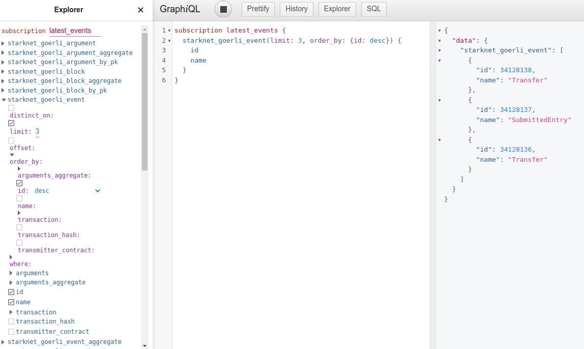

# Subscriptions

A GraphQL subscription is essentially a query where the client receives 
an update whenever the value of any field changes upstream.

Subscriptions are supported for all kinds of queries. All the concepts
of [queries](queries.md) hold true for subscriptions as well.

The subscription will return the latest result of the query being made 
and not necessarily all the individual events leading up to the result.
By default, updates are delivered to clients every 1 sec.

## GraphQL Console

You can turn any query into a subscription by simply replacing `query` 
with `subscription` as the operation type.

Let's try this query in the [web console](../../console). It fetches
names of the three latest events emitted by smart contracts in StarkNet
goerli chain. To get the latest we `order_by` auto incremented event
`id` descending.

```graphql
query latest_events {
  starknet_goerli_event(limit: 3, order_by: {id: desc}) {
    id
    name
  }
}
```

You should receive results similar to these. If you keep executing the
query, you'll be getting more recent events, still limited to the 3
latest ones.

```json
{
  "data": {
    "starknet_goerli_event": [
      {
        "id": 34127040,
        "name": "Transfer"
      },
      {
        "id": 34127039,
        "name": "SubmittedEntry"
      },
      {
        "id": 34127038,
        "name": "SubmittedEntry"
      }
    ]
  }
}
```

Now change the operation type from `query` to `subscription`.
 
```graphql
subscription latest_events {
  starknet_goerli_event(limit: 3, order_by: {id: desc}) {
    id
    name
  }
}
```
 
Click the execution button and see the results start updating
automatically in the results pane. Note the button icon
changed from *play* to *stop*.



## Node.js

We put together a simple example client that subscribes to the
blockchain indexer. It is just a few lines of javascript code in
[subscriber Github repo](https://github.com/SummaryDev/subscriber). Use
it as a starting point for your own client that reacts to blockchain
events.

The example client will wait for events which represent changes in the
results of a GraphQL query, will print them out and exit after three
events have been received.

Its default *subscription* query fetches the three latest blocks.

```graphql
subscription { starknet_goerli_block(limit: 3, order_by: {block_number: desc}) { block_number, block_hash }}
```

You can pass your own subscription query as an argument. The following
query waits for the latest events emitted. Note both this and the
default query order results ordered `desc` to get the latest. If you
query without ordering you'll get the first rows which don't change and
don't trigger events.

```bash
npm start 'subscription {starknet_goerli_event(limit: 3, order_by: {id: desc}) {id, name}}'
```

## Communication protocol

Our backend Hasura GraphQL engine uses the
[GraphQL over WebSocket Protocol](https://github.com/apollographql/subscriptions-transport-ws/blob/master/PROTOCOL.md)
by the
[apollographql/subscriptions-transport-ws](https://github.com/apollographql/subscriptions-transport-ws)
library and the
[GraphQL over WebSocket Protocol](https://github.com/enisdenjo/graphql-ws/blob/master/PROTOCOL.md)
by the [graphql-ws](https://github.com/enisdenjo/graphql-ws) library for
sending and receiving events. The GraphQL engine uses the
`Sec-WebSocket-Protocol` header to determine the communication protocol
that'll be used. By default, the GraphQL engine will use the
`apollographql/subscriptions-transport-ws` protocol.